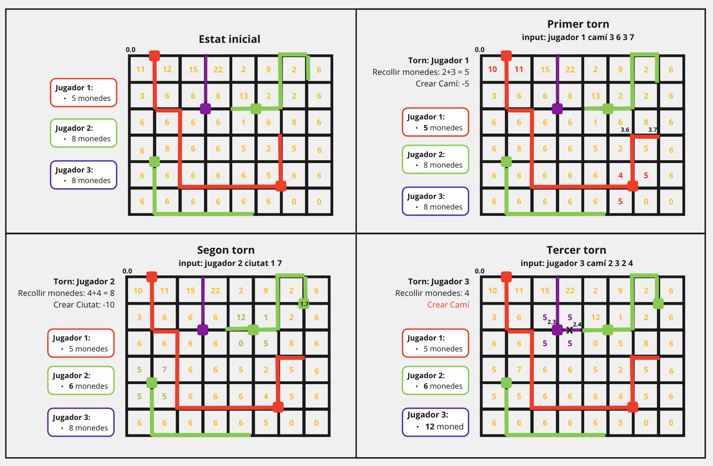
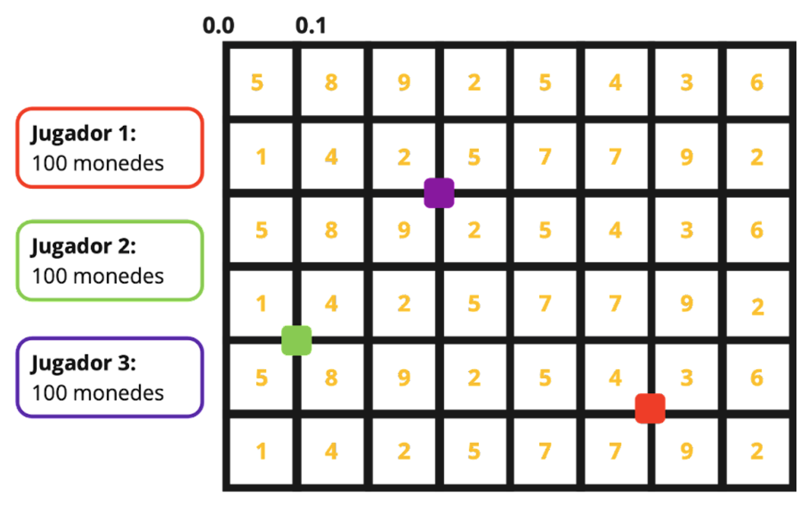
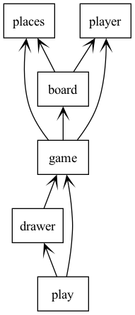



# Pràctica GCED-AP2 2024 · Ciutats i Camins

En aquesta pràctica, tindràs l'oportunitat d'implementar una aplicació pel joc d'estratègia anomenat "Ciutats i Camins" (lleugerament basat en Catan™️).

Aquest joc es desenvolupa en un tauler rectangular dividit en cel·les que contenen recursos que s'extingeixen a mesura que s'extreuen. Els jugadors poden convertir aquests recursos en monedes que afegeixen al seu tresor. Gràcies a les monedes, poden construir ciutats i camins per competir per nous recursos i el control del territori.


# Desenvolupament de la pràctica

Aquesta pràctica té dues parts:

1.  A la primera part has d'implementar el joc de Camins i Ciutats.

    Has de lliurar la pràctica a través de l'aplicació **Mussol**. Per a fer-ho, vés a https://mussol.jutge.org, identifica't amb el teu usuari oficial de la UPC (acabat amb `@estudiantat.upc.edu`) i la teva contrasenya de Jutge.org i tria l'activitat "AP2 2024 Camins i Ciutats". Has de lliurar un fitzer `zip` amb els continguts que es descriuen més tard.

    Compte: cal tenir cura de **NO** identificar els continguts lliurats amb el teu nom o altre informació personal teva: el teu lliurament ha de ser completament anònim. Això també s'aplica als noms dels fitxers.

    La data límit per lliurar la primera part de la teva pràctica és el dimecres 27 de març fins a les 15:00.

2.  A la segona part de la pràctica has de corregir tres pràctiques d'altres companys. Aquesta correcció es farà també a través de **Mussol** i implicarà valorar diferents rúbriques que només veuràs en aquest punt.

    L'avaluació també serà anònima. El sistema calcularà automàticament la teva nota i també avisarà als professors de possibles incoherències. Els abusos seran penalitzats. Cada estudiant té el dret de rebutjar la nota calculada a partir de la informació rebuda dels seus companys i pot demanar l'avaluació per part d'un professor (qui podrà puntuar a l'alta o a la baixa respecte l'avaluació dels estudiants). Els professors també poden corregir pràctiques "d'ofici" i substituir la nota calculada per la del professor.

    Pots començar a corregir les pràctiques dels vostres companys a partir del divendres 29 de març a les 15:00. La data límit per lliurar la segona part de la teva pràctica és el dilluns 15 d'abril a les 15:00. No podràs veure les correccions dels teus companys fins al dimexcres 18 d'abril a les 15:00.

Totes les pràctiques s'han de fer en solitari. Els professors utilitzaran programes detectors de plagi. És obligatori corregir les pràctiques dels tres companys assignades pel **Mussol**.


# Regles de Camins i Ciutats

(Tots els paràmetres inicials del joc es determinen com a paràmetres de l'entrada.)

- **Jugadors:** El joc pot ser jugat per qualsevol nombre no nul de jugadors.

- **Tauler, arestes i nodes:** El tauler està format per una graella rectangular de cel·les. Cada cel·la té un cert nombre de recursos inicials. Cada cel·la té quatre arestes al seu voltant on es poden construir camins (fins i tot a les cel·les dels extrems del tauler). Les interseccions de les arestes es coneixen com a nodes i són els únics llocs on es poden construir ciutats.

- **Inici del joc:** Cada jugador comença amb una ciutat construïda al tauler i una quantitat inicial de monedes al seu tresor.

- **Torns**: El joc es desenvolupa per torns i, a cada torn, el jugador actual realitza les dues tasques següents en ordre:

    1. *Recollida de recursos:* Per cada cel·la adjacent a cadascuna de les seves ciutats, el jugador recull una unitat de recursos que es transforma en una moneda al seu tresor i que es descompta dels recursos disponibles en aquella cel·la. Les cel·les sense recursos ja no atorguen monedes. Si un jugador té més d'una ciutat sobre una cel·la, guanya tantes monedes com ciutats (mentre hi hagi prou recursos a la cel·la).

    2. *Acció:* El jugador pot triar realitzar una de les següents accions:

        - Construir camí: El jugador pot construir un camí en una aresta si es donen totes aquestes condicions:

            - Aquella aresta encara no té un camí de cap jugador.

            - Un dels extrems de l'aresta té una ciutat o un camí del mateix jugador.

            - Cap dels extrems de l'aresta té un camí d'un altre jugador (a no ser que aquell node sigui una ciutat, perquè les ciutats promouen intercanvis).

            Cada construcció de camí té un cost en monedes, que es descompten del tresor de cada jugador.

        - Construir ciutat: El jugador pot construir una ciutat en qualsevol node adjacent als seus camins on no hi hagi actualment una ciutat. Cada construcció de ciutat té un cert cost en monedes, que es descompten del tresor de cada jugador. El nombre màxim de ciutats per a cada jugador és limitat.

        - Destruir ciutat: El jugador pot destruir una de les seves ciutats. Cada destrucció té un cost determinat en monedes, que es descompten del tresor de cada jugador.

    No es poden fer aquestes accions si el tresor de cada jugador no disposa de les monedes necessàries per pagar el seu cost.

    Si un jugador intenta realitzar una acció il·legal, perd el torn.

- **Objectiu del Joc:** El joc es juga durant un cert nombre de torns. El jugador amb més monedes al seu tresor al final del joc és el guanyador.

## Exemple

A continuació es mostra un exemple visual de l'evolució del joc  començant des d'un estat inicial a mitja partida, on juguen tres jugadors, i on el preu per construir camí és de 5 monedes, i el de construir ciutat 10. Els segments gruixuts representen camins i els quadrats omplerts ciutats.



La primera i segona tirada realitzades pels jugadors 1 i 2 respectivament, són vàlides. Però, la tercera tirada, mostra un exemple de jugada il·legal, on el jugador 3 vol construir un camí on un dels seus extrems toca el camí d'un altre jugador.


## Estat inicial

A continuació es mostra un exemple de com es dona l'entrada per iniciar el joc i el tauler corresponent:

```text
number_turns 5
path_price 5
city_price 10
destruction_price 15
initial_cash 100
max_cities 5
board_size 6 8
5 8 9 2 5 4 3 6
1 4 2 5 7 7 9 2
5 8 9 2 5 4 3 6
1 4 2 5 7 7 9 2
5 8 9 2 5 4 3 6
1 4 2 5 7 7 9 2
num_players 3
player_color darkred
player_color darkgreen
player_color purple
player_city 5 6
player_city 4 1
player_city 2 3
```




## Accions

Un cop donada la descripció inicial del tauler, l'entrada conté les accions de cada jugador. Per claredat, cada jugada inclou el número del jugador.

```text
build_path 1 5 6 5 7
build_path 2 4 1 4 2
build_path 3 2 3 3 3
build_city 1 5 7
destroy_city 2 4 1
```

El fitxer `sample.inp` conté un exemple sencèr de partida.


# Arquitectura de l'aplicació

L'arquitectura de l'aplicació ja ve donada, així com la definició de les operacions d'algunes classes.  Aquesta és l'estructura:



Pots agafar l'esquelet de l'aplicació del directori [skeleton](skeleton).

## Mòdul `places`

El mòdul `places` conté els tipus `BoxSize`, `Coord` i `Path` que són usats per tots els altres mòduls.

## Mòdul `player`

El mòdul `player` conté la classe `Player` que enmagatzema la informació relativa a un jugador.

```python
class Player:
    def __init__(self, id: int, cash: int, color: str): ...
    def get_id(self) -> int: ...
    def get_cash(self) -> int: ...
    def get_color(self) -> str: ...
    def update_cash(self, value: int) -> None: ...
```

## Mòdul `board`

El mòdul `board` conté la classe `Board` que enmagatzem la informació relativa al tauler de joc.

```python
class Board:
    def __init__(self, size: BoxSize, initial_resources: list[list[int]]): ...
    def get_size(self) -> BoxSize: ...
    def get_resources(self, coord: Coord) -> int: ...
    def get_cities(self) -> list[tuple[Player, Coord]]: ...
    def get_paths(self) -> list[tuple[Player, Path]]: ...
    def add_city(self, player: Player, coord: Coord) -> None: ...
    def add_path(self, player: Player, path: Path) -> None: ...
    def remove_city(self, coord: Coord) -> None: ...
    def substract_resource(self, coord: Coord) -> None: ...
```

## Mòdul `game`

El mòdul `game` defineix la classe `Game` que és la que uneix el tauler de joc amb els jugadors i s'encarrega de llegir l'entrada per anar simulant el joc torn a torn.

```python
class Game:
    def __init__(self): ...
    def next_turn(self) -> None: ...
    def get_board(self) -> Board: ...
    def get_players(self) -> list[Player]: ...
    def get_current_player(self) -> Player: ...
    def is_game_over(self) -> bool: ...
```

El constructor llegeix la part de la definició del tauler i cada crida a `next_turn` llegeix (i executa si és legal) l'acció del jugador a qui li toca jugar en aquell torn.

## Mòdul `play`

El programa principal que es troba al mòdul `play` ja es dóna implementat i permet visualitzar el desenvolupament del joc utilitzant la llibreria [pygame](https://www.pygame.org/docs/). Cal instal·lar aquesta llibreria amb `pip3 install pygame`

El programa s'ha de poder executar sobre un fitxer `sample.inp` amb la comanda

```bash
python3 play.py < sample.inp
```

## Mòdul `drawer`

El mòdul `drawer` ja s'et dóna implementat i s'encarrega de mostrar el joc amb `pygame` tot utilitzant les operacions públiques de cada classe.


# Feina a fer

La teva feina consisteix en acabar d'implementar els mòduls `places`, `player`, `board` i `game` per tal que el joc es pugui simular i visualitzar. Opcionalment, i només si has fet tota la feina anterior, també pots modificar els mòduls `play` i `drawer` per fer la visualització més atractiva.

La implementació de les classes requerides ha de seguir la interfície de les operacions públiques donades. No es poden canviar aquestes operacions, ni la seva interfície, ni afegir noves operacions públiques. Per a la implementació, es pot afegir qualsevol recurs que es consideri adient.

Pots assumir que tots els fitxers d'entrada segueixen l'estructura donada als exemples. Ara bé, no pots assumir que les dades que hi figurin siguin correctes. Per exemple l'acció `build_city` sempre anirà seguida de tres enters (jugador i coordenades), però potser el valor del jugador pot ser erroni o les coordenades fora del tauler. Pren una decisió de disseny i documenta-la en aquests casos.

Malgrat que en la realitat el joc es jugaria amb pocs jugadors, amb un tauler petit i un nombre petit de torns, tria els teus algorismes i estructures de dades internes suposant que els valors són grans.


# Lliurament

Lliura la teva pràctica en un fitzer `.zip` que contigui:

- Tots els fitxers `.py` necessaris.
- La icona `ciutats-i-camins.png`.
- Un fitxer `README.md` escrit en Markdown que contingui la informació de la teva pràctica. Consulta https://www.markdownguide.org/cheat-sheet/ i https://www.makeareadme.com/ per exemple.
- Si cal, imatges a `images/*.png` per complementar el `README.md`.
- Fitxers `test-*.inp` amb els jocs de proves desenvolupats.

El fitxer `.zip` no ha de contenir res més.


# Consells

- Comprova que cada part que fas funciona correctament, documenta el teu codi amb els comentaris necessaris i sense comentaris innecessaris i especifica totes les classes i mètodes amb *docstrings*.

- Assegura't que el teu programa inclou els tipus de tots els paràmetres i resultats a totes les funcions i que no hi ha errors de tipus amb `mypy`.

- Per evitar problemes de còpies, no pengis el teu projecte en repositoris públics.

- No esperis al darrer instant per fer el lliurement. De debò. No, no és bona idea: el **Mussol** no et deixarà fer lliuraments passats els terminis. Pots fer múltiples lliuraments, el bo sempre és el darrer.


# Autors

Clara Rovira, Jordi Petit

©️ Universitat Politècnica de Catalunya, 2024